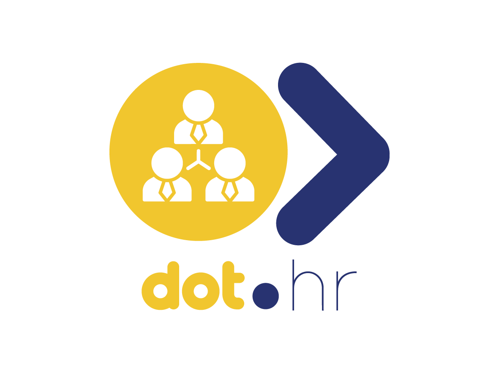

<div align="center">



<br /><br />

**Employment records, roles, and leave — the Dot Ecosystem's workforce platform.**

<br />

   

<br /><br />

**Part of the Dot Ecosystem** &nbsp;·&nbsp; `hr.infodot.app`

</div>

---

## Status: unverified hand-authored scaffolding

This codebase was hand-authored in an environment with **no local PHP, Composer, or PostgreSQL** —
nothing here has been run, migrated, or tested. It was written carefully and reviewed by hand, but
until it runs once in a real environment (`composer install && php artisan migrate && php artisan
test`), treat every claim in this README as intent, not a verified guarantee. See `wiki.md`'s change
log for the same caveat in the platform's own knowledge doc.

## What is Dot.HR?

Dot.HR is the Dot Ecosystem's workforce management platform: employment records, roles, and leave
requests, team-scoped the same way every other Jetstream Teams platform in the ecosystem is. Per the
platform's own design principle ("work, not workers" — see `wiki.md` §2), Dot.HR is built to keep
individual-level employment data platform-internal; nothing here is designed to leave the platform at
the individual level.

## Domain (MVP)

| Model | Purpose |
|---|---|
| **Position** | A job/role definition — describes work, not a worker. Team-owned org structure. |
| **Employee** | An employment record. Minimal PII surface by design: name, work email/phone, position, employment type, status, start/end date. No national ID, no salary, no medical data — see the model's docblock. |
| **LeaveRequest** | A leave request tied to one employee, with a pending/approved/denied workflow. The free-text `reason` field is treated as sensitive since it can incidentally carry health information. |

Out of scope for this MVP (see `wiki.md` roadmap): payroll integration, benefits administration,
full performance-review cycles, individual productivity scoring (deliberately never planned — see
`wiki.md` §8).

## Authorization

Every sensitive model ships with a Laravel Policy from the first commit — `EmployeePolicy`,
`PositionPolicy`, `LeaveRequestPolicy` — each checking `$user->belongsToTeam($model->team)`, the same
pattern used across the ecosystem's other team-scoped platforms (Dot.Billing's
`BillingInvoicePolicy`) and the fix applied retroactively to Dot.Tasks and Dot.Finance earlier this
session. `tests/Feature/HrAuthorizationTest.php` is the regression guard: it asserts one team cannot
view, edit, delete, or leak another team's employee and leave-request records.

## Tech Stack

| Layer | Technology |
|---|---|
| Framework | Laravel 12 |
| Language | PHP 8.3 |
| Frontend | Livewire 3 · Alpine.js 3 · Tailwind CSS |
| Database | PostgreSQL (shared ecosystem instance) |
| Auth | Laravel Sanctum (ecosystem SSO) + Jetstream/Fortify (teams, 2FA) |
| Queue | Database queue driver |

## Quick Start (untested — see status note above)

```bash
git clone <this-repo>
cd Dot.HR
cp .env.example .env
composer install
npm install && npm run build
php artisan key:generate
php artisan migrate
php artisan db:seed   # optional: fictional demo data
php artisan serve
```

### Running Tests

```bash
php artisan test
```

Feature tests use SQLite/RefreshDatabase per `phpunit.xml` — no shared Postgres instance required.

## PII & Data Protection — Roadmap, Not a Guarantee

Team-scoped authorization is built in from the start. Everything beyond that — POPIA/GDPR field-tier
mapping, encryption at rest for any future sensitive field, the aggregation layer that would let
Dot.HR publish workforce-structure knowledge without ever exposing individuals — is roadmap intent
described in `wiki.md` §9, not implemented here. Do not treat this repository as production-ready for
real employee data until that review happens.

## Ecosystem

Dot.HR is one platform in the Dot Ecosystem, unified by [Dot.Brain](../Dot.Brain), the ecosystem's
shared knowledge repository. See `wiki.md` for this platform's own architecture doc, and
[Dot.Brain's ingested view](../Dot.Brain/platforms/dot-hr.md) for integration mechanics.

## License

See `LICENSE`.
