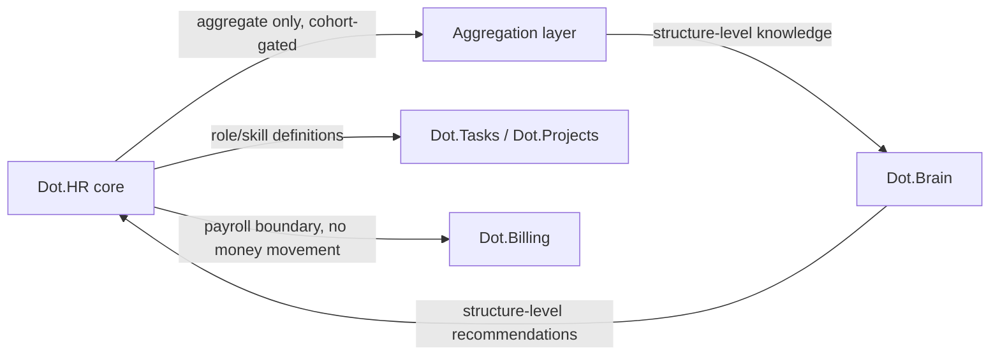

# Dot.HR

Purpose: this is Dot.HR's own knowledge home — owned and maintained by the Dot.HR team. It describes what this platform is, what it manages, and how it connects to the wider Dot Ecosystem. Dot.Brain never edits this file; it only reads what we choose to publish.

> **Related:** [Dot.Brain's ingested view of this platform](https://github.com/sakhilebhayi/Dot.Brain/blob/main/platforms/dot-hr.md)

---

## 1. What Dot.HR Is

Dot.HR is the Dot Ecosystem's workforce management platform: employment records, skills and certifications, scheduling, leave, and workforce planning. It owns the people domain — the ecosystem's most person-sensitive data, since nearly every field is PII and the data subjects are also the employees themselves, subject to a power asymmetry that no consent checkbox resolves.

**Status:** early-stage. This repository does not yet contain application code; this wiki is the architecture blueprint the implementation will follow. Treat every section below as design intent, not shipped behavior, until the change log says otherwise.

## 2. Design Principle: Work, Not Workers

The rule that shapes everything else here: **Dot.HR publishes knowledge about work — roles, skills, schedules, workforce structures — and never publishes knowledge that models, ranks, or predicts an identified or identifiable individual.** Employment records (names, IDs, salary, disciplinary history, health/disability data) are planned to be excluded from the shared knowledge graph at the type level — not filtered at review time, but structurally absent from what can ever be published. This is a stricter posture than "redact PII before sharing"; it means the category of individual-level record has no representation in the outbound data model at all.

Data-protection posture (POPIA/GDPR alignment, field-level classification, encryption at rest) is roadmap intent, not an implemented guarantee — see §9. Nothing in this document should be read as a claim that specific technical safeguards are already in place; that will be stated plainly here, with evidence, once it is true.

## 3. Domain Entities (Planned)

| Entity | Notes |
|---|---|
| Role definition | Describes a job/position — publishable, describes work not a worker |
| Skill / certification type | The taxonomy of skills and certs; publishable. Who holds which is not. |
| Roster / schedule template | The structure of a shift pattern; publishable as structure |
| Workforce observation | Aggregate-only rollups (coverage, lapse rates) — never individual-level |
| Employment record | Platform-internal only. No plan to expose this to the shared graph. |

## 4. Events We Plan to Emit

| Event | Trigger | Frequency (intent) |
|---|---|---|
| `people.certification.expiring_cohort` | A cohort of certifications nears expiry (aggregate, above a minimum group size) | weekly |
| `people.roster.published` | A schedule cycle closes | per cycle |
| `people.vacancy.aging` | A role stays unfilled past a threshold | as triggered |

These are intent, named for consistency with Dot.Brain's ingestion contract — none are implemented yet.

## 5. Architecture (Intended)

- **Core service**: employment records, roles, skills/certs, scheduling, leave — the system of record for the people domain.
- **Aggregation layer**: the only path by which anything leaves the platform toward the shared knowledge graph. Individual-level data cannot flow through it by construction — it accepts cohort-level inputs (minimum group size enforced) and emits only structural/aggregate outputs.
- **Boundary with Dot.Billing**: HR owns the roster; Billing owns money movement. Payroll execution is explicitly out of scope here.
- **Boundary with Dot.Tasks/Dot.Projects**: HR owns role/skill definitions; task assignment (who does what today) belongs to Tasks.

## 6. Connecting to Dot.Brain

Dot.HR intends to participate in the ecosystem as a registered platform (`dot-hr`) that publishes Knowledge Packs about workforce structure — never about individual workers.

| Payload type | Cadence (intent) | Contains |
|---|---|---|
| `observation` | monthly | skills-coverage and roster-pattern aggregates |
| `insight` | per finding | workforce-structure findings |
| `outcome` | per verified recommendation | recommendation verification results |
| `incident` | per incident | PII-gate events, scheduling failures |

Consumption rule (intent): recommendations from Dot.Brain may target structures — rosters, role definitions, renewal calendars — never individuals. "Schedule person X differently" would not be a valid recommendation; "this shift-overlap pattern reduces unfilled shifts" would be.

Full manifest, entity/event mapping, the field-classification tiering, and a worked publish-to-PR round-trip are maintained on the Brain side at [`platforms/dot-hr.md`](https://github.com/sakhilebhayi/Dot.Brain/blob/main/platforms/dot-hr.md) — that document is Dot.Brain's ingested view and is authoritative for integration mechanics; this wiki is authoritative for what Dot.HR actually *is*.

## 7. Domain Metrics (Planned)

| ID | Type | Definition |
|---|---|---|
| `people.critical_role_coverage_rate` | ratio | Critical roles with qualified coverage at or above plan, over all critical roles |
| `people.cert_lapse_rate` | ratio | Certifications lapsed while the role is active, over certifications due, quarterly |
| `people.unfilled_shift_rate` | ratio | Shifts unfilled at cycle close, over shifts planned |

## 8. Engagement Mechanics — Deliberately Constrained

Dot.HR is, by nature, the highest-risk platform in the ecosystem for engagement mechanics aimed at workers by their employer. Planned posture: no individual productivity scores, no attendance streaks, no peer comparison of any kind, no "top performer" surfaces. If any milestone/recognition mechanic ships, it is scoped to team-level certification or coverage goals — never to an individual — consistent with the ecosystem's ethical-engagement rules.

## 9. Roadmap

- [ ] Stand up the core service: employment records, roles, skills/certs, scheduling, leave
- [ ] Build the aggregation layer as a structural boundary (not a filter) between individual and shared data
- [ ] Define and implement the field-classification register (prohibited / aggregate-only / aggregate-standard / open tiers)
- [ ] POPIA/GDPR field-tier mapping and sign-off
- [ ] Implement the three named events and first Knowledge Pack publication
- [ ] Team-level certification/coverage recognition surface (only engagement mechanic in scope)
- [ ] Worker-visibility channel for aggregate categories published about the workforce

## Change Log

| Version | Date | Author | Change |
|---|---|---|---|
| 0.1.0 | 2026-08-01 | HR Platform Lead | Initial wiki: architecture blueprint derived from Dot.Brain's platforms/dot-hr.md, adapted to platform-owned framing with data-protection claims reframed as roadmap intent |

## Open Questions

- POPIA/GDPR field-tier mapping final sign-off — blocked on Dot.Brain's legal-identity resolution work, shared with Dot.Billing.
- Worker-visibility rule: delivery channel for publishing aggregate categories back to the workforce itself — via Dot.Notify digest, or an in-platform page?
- Minimum cohort size for aggregate publication — Dot.Brain's ingested view assumes n ≥ 50/100 by tier; needs independent validation once real workforce-size distributions are known.
