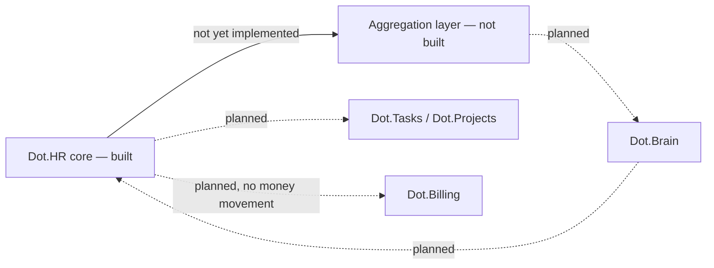

# Dot.HR

Purpose: this is Dot.HR's own knowledge home — owned and maintained by the Dot.HR team. It describes what this platform is, what it manages, and how it connects to the wider Dot Ecosystem. Dot.Brain never edits this file; it only reads what we choose to publish.

> **Related:** [Dot.Brain's ingested view of this platform](https://github.com/sakhilebhayi/Dot.Brain/blob/main/platforms/dot-hr.md)

---

## 1. What Dot.HR Is

Dot.HR is the Dot Ecosystem's workforce management platform: employment records, roles, and leave, built on Laravel 12 + Jetstream Teams like the rest of the ecosystem's team-scoped platforms. It owns the people domain — the ecosystem's most person-sensitive data, since nearly every field is PII and the data subjects are also the employees themselves, subject to a power asymmetry that no consent checkbox resolves.

**Status: MVP scaffolded, unverified.** This repository now contains real, hand-authored application code — Jetstream Teams shell, HR domain models, migrations, Policies, controllers, views, and tests — but it was written in an environment with no local PHP, Composer, or PostgreSQL, so **none of it has actually been run**. Treat the code as a careful, reviewed draft, not a tested build, until `composer install && php artisan migrate && php artisan test` has been run for real. See the change log below.

## 2. Design Principle: Work, Not Workers

The rule that shapes everything else here: **Dot.HR publishes knowledge about work — roles, skills, schedules, workforce structures — and never publishes knowledge that models, ranks, or predicts an identified or identifiable individual.** Employment records (names, contact details, role, employment status) are excluded from the shared knowledge graph at the type level — not filtered at review time, but structurally absent from what can ever be published. This is a stricter posture than "redact PII before sharing"; it means the category of individual-level record has no representation in the outbound data model at all, and today it isn't wired to any outbound path at all — there is no aggregation layer yet (see §9).

Data-protection posture (POPIA/GDPR alignment, field-level classification, encryption at rest) remains roadmap intent, not an implemented guarantee — see §9. The MVP domain layer deliberately keeps its PII surface minimal (name, work contact, role, employment status/dates) and avoids the `prohibited`-tier fields named in Dot.Brain's field-classification register entirely — no national ID/passport numbers, no salary, no medical or disciplinary data. If those fields are ever added, they need real encryption-at-rest and access-control review first, per Dot.Brain's `os/17-Security.md`.

## 3. Domain Entities (Built, MVP)

| Entity | Table | Notes |
|---|---|---|
| `Position` | `positions` | Job/role definition — describes work, not a worker. Team-scoped org structure. |
| `Employee` | `employees` | Employment record. Minimal PII: name, work email/phone, position, employment type, status, start/end date, optional link to a platform `User` login. No ID numbers, salary, or medical data. |
| `LeaveRequest` | `leave_requests` | Pending/approved/denied leave workflow, tied to one employee. Free-text `reason` treated as sensitive (can incidentally carry health information). |

Not yet built (see §9 roadmap): skills/certification tracking, roster/schedule templates, the aggregation layer, and any of the events/metrics described in §4/§7 below — those remain design intent inherited from the original blueprint, unchanged from v0.1.0.

## 4. Events We Plan to Emit (unchanged — not yet implemented)

| Event | Trigger | Frequency (intent) |
|---|---|---|
| `people.certification.expiring_cohort` | A cohort of certifications nears expiry (aggregate, above a minimum group size) | weekly |
| `people.roster.published` | A schedule cycle closes | per cycle |
| `people.vacancy.aging` | A role stays unfilled past a threshold | as triggered |

These remain intent, named for consistency with Dot.Brain's ingestion contract — none are implemented. No aggregation layer exists yet to safely emit them.

## 5. Architecture (Current)

- **Core service (built)**: Laravel 12 + Jetstream Teams + Fortify + Sanctum, team-scoped throughout. `Position`, `Employee`, `LeaveRequest` are the system of record for the MVP people domain.
- **Aggregation layer (not built)**: still the only intended path by which anything would leave the platform toward the shared knowledge graph. No code exists for this yet — the MVP has no outbound integration at all.
- **Boundary with Dot.Billing**: HR owns the roster; Billing owns money movement. Payroll execution is explicitly out of scope here, and no Billing integration exists in this codebase.
- **Boundary with Dot.Tasks/Dot.Projects**: HR owns role/skill definitions; task assignment (who does what today) belongs to Tasks. No integration exists yet.

## 6. Connecting to Dot.Brain

Dot.HR intends to participate in the ecosystem as a registered platform (`dot-hr`) that publishes Knowledge Packs about workforce structure — never about individual workers. **None of this is implemented in code yet** — this section remains design intent.

| Payload type | Cadence (intent) | Contains |
|---|---|---|
| `observation` | monthly | skills-coverage and roster-pattern aggregates |
| `insight` | per finding | workforce-structure findings |
| `outcome` | per verified recommendation | recommendation verification results |
| `incident` | per incident | PII-gate events, scheduling failures |

Consumption rule (intent): recommendations from Dot.Brain may target structures — rosters, role definitions, renewal calendars — never individuals.

Full manifest, entity/event mapping, the field-classification tiering, and a worked publish-to-PR round-trip are maintained on the Brain side at [`platforms/dot-hr.md`](https://github.com/sakhilebhayi/Dot.Brain/blob/main/platforms/dot-hr.md) — that document is Dot.Brain's ingested view and is authoritative for integration mechanics; this wiki is authoritative for what Dot.HR actually *is*.

## 7. Domain Metrics (Planned, not yet computed)

| ID | Type | Definition |
|---|---|---|
| `people.critical_role_coverage_rate` | ratio | Critical roles with qualified coverage at or above plan, over all critical roles |
| `people.cert_lapse_rate` | ratio | Certifications lapsed while the role is active, over certifications due, quarterly |
| `people.unfilled_shift_rate` | ratio | Shifts unfilled at cycle close, over shifts planned |

None of these are computed by the MVP — there is no certification or scheduling data model yet.

## 8. Engagement Mechanics — Deliberately Constrained

Dot.HR is, by nature, the highest-risk platform in the ecosystem for engagement mechanics aimed at workers by their employer. Posture (unchanged, still design intent — no engagement mechanics of any kind exist in this MVP): no individual productivity scores, no attendance streaks, no peer comparison of any kind, no "top performer" surfaces. If any milestone/recognition mechanic ships, it is scoped to team-level certification or coverage goals — never to an individual.

## 9. Roadmap

- [x] Stand up the core service MVP: employment records, roles, leave — with team-scoped authorization from the first commit
- [x] **Role-gate Employee/LeaveRequest/Position mutations beyond team membership.** `create`/`update`/`delete` on all three now require the team's `admin` role or ownership (`hasTeamRole($team, 'admin')` / `ownsTeam($team)`); `view`/`viewAny` stay open to any team member for day-to-day roster/leave-approval work. `LeaveRequest::create` is gated too (not just update/delete), since this app has no "an Employee's own User account" concept yet — any member could otherwise fabricate a leave record for an arbitrary employee. Covered by `tests/Feature/HrAuthorizationTest.php`'s role-gating block (editor-forbidden / admin-allowed pairs for all three models plus leave-approval).
- [ ] Skills/certifications and scheduling/roster models
- [ ] Build the aggregation layer as a structural boundary (not a filter) between individual and shared data
- [ ] Define and implement the field-classification register (prohibited / aggregate-only / aggregate-standard / open tiers) in code, not just doc
- [ ] POPIA/GDPR field-tier mapping and sign-off
- [ ] Implement the three named events and first Knowledge Pack publication
- [ ] Team-level certification/coverage recognition surface (only engagement mechanic in scope)
- [ ] Worker-visibility channel for aggregate categories published about the workforce
- [ ] Actually run this codebase against real PHP/Composer/PostgreSQL and fix whatever the first `php artisan migrate` and `php artisan test` reveal — see change log

## Change Log

| Version | Date | Author | Change |
|---|---|---|---|
| 0.7.0 | 2026-08-06 | Platform-loop pass | Redesigned `resources/views/welcome.blade.php` following the ecosystem's guest-facing-design pattern established by Dot.Mines' pilot (same four combined skills: `frontend-design`, `design-taste-frontend-v1`, `emil-design-eng`, `ui-ux-pro-max`). The prior page (from 0.5.0) copied Dot.Mines' pilot structure but never developed its own visual identity — a generic near-black `bg-gray-900` background, indigo gradient buttons/text, floating blurred glow orbs, a fake "dashboard preview" card with badge clutter, and two hotlinked Unsplash office photos, none of it grounded in Dot.HR's own real brand. Opened the real logo (`public/images/logo-512.png`) directly and sampled its actual colors — a mustard-gold circle holding a white pyramid-of-people icon, a navy chevron, and a "dot" (gold) + ".hr" (navy) wordmark on a plain white field — and built a light, paper-toned palette from it instead of copying Dot.Mines' dark ink/gold/umber theme or defaulting to another dark-mode near-black: `--paper #faf7f0`, `--paper-deep #f1ead9`, `--ink #21255a` (deep navy, sampled from the wordmark/chevron, standing in for the banned pure-black), `--gold #f0b91c` / `--gold-deep #c98a09` (from the circle), single accent. Typography: `Fraunces` (warm variable-optical-size serif, display) + `Karla` (humanist body sans) + `IBM Plex Mono` (data/labels/eyebrows) — deliberately distinct from Dot.Mines' `Outfit`/`Plus Jakarta Sans`/`JetBrains Mono` pairing and from Inter, chosen for an HR/people-management register (editorial warmth over pure SaaS-tech). Replaced the centered hero, 3-and-6-card grids, and floating badge clutter with an asymmetric hero (text left, signature art right) and the same divided-list pattern as the pilot (hairline borders, mono field-tags, no numbered markers since neither the six entities nor the six ecosystem-boundary items are a sequence). New signature element: a quiet line-art three-tier org-chart / reporting-structure tree (one root node, two managers, four reports, connected by thin lines) at 10% opacity in the hero — a redrawn echo of the logo's own pyramid-of-people icon, not a reuse of Dot.Mines' headframe silhouette. Copy rewritten from this wiki's own §1 and §3: removed the fabricated "AI-assisted" framing and vague marketing copy ("Manage Your Workforce, Not Workers" gradient headline, unlabeled stat tiles) in favor of concrete claims — the six domain-entity rows and six ecosystem-boundary rows are drawn directly from §3's entity table, §5's boundary notes, §8's "no individual scoring" posture, and 0.6.0's own real test count (43 tests, 91 assertions passing against Postgres), not invented figures. Removed all `href="#"` dead links (the old footer's three-column Product/Company/Legal link grid, all pointing nowhere) in favor of a minimal footer matching the pilot: logo, tagline, copyright only. Dropped the two hotlinked Unsplash office photos in favor of the paper/signature-art treatment — a deliberate choice for this domain (records/structure) over borrowed stock photography, and it removes an external-image dependency from the guest page entirely. Motion pared back to the pilot's single restrained scroll-reveal (`IntersectionObserver`, `prefers-reduced-motion` respected) and `scale(0.97)` press-feedback — removed the prior page's perpetual `float`/`ping`/`pulse` animations and hover-scale card transforms. **Verified end-to-end, including the specific lesson from the Dot.Mines pilot's own follow-up fix (`dfc4547`, nav logo too small to read at 36px)**: nav logo built at `h-16 sm:h-20` (64px mobile / 80px sm+) and footer at `h-11` (44px) from the first commit, not discovered as a defect afterward. Confirmed via real render, not assumption — `npm run build` clean (Tailwind v3, existing `postcss.config.js`/`tailwind.config.js` toolchain, no changes needed there), `php artisan serve --port=8815` (session-scoped `SESSION_DRIVER=array` override only, since this sandbox's Postgres database doesn't exist yet — `.env` untouched), rendered in a real browser at 375×812 (mobile), 500×900 (narrow logo-legibility check), and 1680×1000 (wide desktop): logo crisp and legible at every width via both visual screenshot and a `getBoundingClientRect()` check (nav 64px height at 500px viewport, footer 44px height), zero horizontal overflow (`scrollWidth === innerWidth` at both 375px and 1680px), zero console errors, and all `route('login')`/`route('register')` links resolving to real Fortify routes (confirmed against `php artisan route:list`) rather than invented paths. |
| 0.6.0 | 2026-08-04 | Platform-loop pass | **Tenant-isolation hardening: model-level team scoping, closing the "forgot a where('team_id', ...)" class of bug at the source.** Added `App\Models\Concerns\HasTeamScope` (`app/Models/Concerns/HasTeamScope.php`), the Jetstream-teams sibling of Dot.Finance's `HasUserScope` and Dot.Notify's identically-named `HasTeamScope` pilots: a global Eloquent scope that constrains every query on a team-owned model to `Auth::user()->currentTeam->id`, fail-closed (`whereRaw('1 = 0')`) if the authenticated user has no current team. Applied to all three — and only the three — team-owned models: `Employee`, `LeaveRequest`, `Position` (confirmed against `database/migrations/2026_08_01_120000_create_hr_tables.php`: these are the only tables carrying `team_id`; `Team`/`User`/`Membership`/`TeamInvitation` are Jetstream's own and out of scope). Simplified `EmployeeController`, `LeaveRequestController`, and the dashboard route (`routes/web.php`) by removing now-redundant explicit `where('team_id', ...)` reads on those three models — the scope covers them. Left untouched, correctly: mass-assignment of `team_id` at `create()` time in both controllers' `store()` methods (the scope only governs reads, per its own docblock); `Rule::exists('positions'/'employees', 'id')->where('team_id', ...)` validation rules (raw DB-facade checks, not Eloquent queries — the global scope doesn't apply and an explicit team check is still required there); and the dashboard's `$team->positions()->count()` relationship-based query (unaffected either way). **Found and fixed a real gap left by this change's own prior partial pass**: a docblock added to `tests/Feature/HrAuthorizationTest.php` correctly described that cross-team `show`/`update`/`destroy`/`approve` requests now 404 (implicit route-model binding queries through the same scope, so another team's row is invisible before any Policy runs — Laravel converts the resulting `ModelNotFoundException` to a 404 automatically) rather than 403 as before, and referenced a proof-of-concept test — but the six affected test bodies still asserted `assertForbidden()` and the referenced test didn't exist anywhere in the repo. Updated all six (`test_user_cannot_view/update/delete_another_teams_employee`, `test_user_cannot_view/approve/delete_another_teams_leave_request`) to `assertNotFound()`, verified against the real cause (route-model-binding failure under the new scope, not a blind edit) rather than assumed. Added the missing proof-of-concept as a dedicated new file, `tests/Feature/HrTeamScopeTest.php`, mirroring Dot.Notify's `NotifyTeamScopeTest.php` pattern adapted to `Employee`: queries the model directly with no explicit `where('team_id', ...)` anywhere in the test, proving the scope itself — not a Policy, not a controller convention — is what blocks cross-team reads. Ran the full suite for real against Postgres: **43 tests, 91 assertions, 42 passed + 1 pre-existing unrelated skip (`Registration screen cannot be rendered if support is disabled`), 0 failures.** `composer audit`: found six real `guzzlehttp/guzzle` advisories (CVE-2026-69246 high, CVE-2026-69245 medium, plus four unnumbered medium advisories — noncanonical host/cookie-domain bypass, cookie DoS, Referer/Proxy-Authorization header leaks), all from `guzzlehttp/guzzle` 7.12.3 pulling in against `<7.15.1`/`<7.15.2` ranges; fixed via `composer update guzzlehttp/guzzle guzzlehttp/psr7 guzzlehttp/promises --with-all-dependencies` (7.12.3→7.15.2, psr7 2.12.3→2.13.0, promises 2.5.0→2.5.1); re-ran `composer audit` clean and the full suite again, still 42/1-skip/0-fail. Added `phpstan/phpstan` + `larastan/larastan` (dev) and `phpstan.neon.dist` (level 5, `paths: [app]`). Unlike prior sessions' sandboxes, `vendor/bin/phpstan analyse` actually executed here and completed: 29 findings, all pre-existing and unrelated to this change — Larastan's generic Eloquent-relation return-type inference not resolving to the concrete model (`Model` instead of `Team`/etc. in several Policies and Jetstream actions), plus three `$fillable`/`$hidden`/`$appends` PHPDoc-covariance notices on `User`/`Team`. None are new regressions introduced by `HasTeamScope` or this pass's controller/test changes; left unfixed as a separate, pre-existing type-inference cleanup, not in scope for a tenant-isolation pass. |
| 0.5.1 | 2026-08-03 | Sakhile Bhayi | Fixed a lingering branding gap: `application-logo.blade.php` (and, where present, `application-mark.blade.php`) still rendered Jetstream's stock placeholder SVG wordmark in the app sidebar/nav and other authenticated-app surfaces, even though the login page's own `authentication-card-logo.blade.php` and the marketing welcome page already used the real logo. These two components render on every authenticated page via Jetstream's own layout, so the placeholder was visible constantly, not just on one screen. Swapped to the real logo file, matching the asset path already used elsewhere in this repo. |
| 0.5.0 | 2026-08-03 | Sakhile Bhayi (AI-assisted) | **Marketing welcome page rebuilt from scratch — it had never been customized.** `resources/views/welcome.blade.php` turned out to be the stock, unmodified Laravel/Jetstream scaffold (default two-column card layout with the Laravel wordmark SVG and a flat pink/red background block) rather than a real marketing page, unlike the sibling `Dot.Mines` repo's pre-built hero/features/CTA layout used as the intended reference pattern. Built a full custom page matching that structural pattern (nav, hero, features, capabilities, principles/CTA, footer) instead, with copy drawn only from this wiki's §1–§9 (Position/Employee/LeaveRequest entities, the "work, not workers" design principle, the Dot.Billing/Dot.Tasks boundary notes, and the honest MVP-scaffolded status) — no fabricated stats, testimonials, or customer logos. Nav and footer brand marks now use the real `public/images/logo.png` lockup in place of the Laravel wordmark SVG. Hero background: real diverse-team-office-collaboration photo by Vitaly Gariev (@silverkblack), unsplash.com/photos/fm4B1xWEIsU (`photo-1758873269276-9518d0cb4a0b`). Principles/CTA section background: real team-collaborating-around-a-computer photo by the same photographer, unsplash.com/photos/UikYLDQj9_I (`photo-1758873268745-dd2cf0d677b5`). Both hotlinked via Unsplash's CDN (images.unsplash.com); both URLs curl-verified (`HTTP/2 200`) before use; photographer credit kept as an inline HTML comment above each background declaration. Accent color kept as Jetstream's existing indigo (already used throughout the app's buttons/nav-links/forms) rather than importing Dot.Mines' amber theme. Dark gradient overlays added on both photo sections for text contrast. |
| 0.1.0 | 2026-08-01 | HR Platform Lead | Initial wiki: architecture blueprint derived from Dot.Brain's platforms/dot-hr.md, adapted to platform-owned framing with data-protection claims reframed as roadmap intent |
| 0.2.0 | 2026-08-01 | HR Platform Lead (hand-authored, AI-assisted) | **Hand-authored MVP scaffolding, unverified.** Jetstream Teams shell copied from Dot.Billing's reviewed boilerplate (Fortify/Jetstream actions, Team/User/Membership/TeamInvitation models, TeamPolicy, providers, ecosystem SSO controller, generic views). New HR domain layer: `Position`, `Employee`, `LeaveRequest` models and migrations, all team-scoped via `team_id`; `EmployeePolicy`, `PositionPolicy`, `LeaveRequestPolicy` enforcing `$user->belongsToTeam($model->team)` from the first commit (no authorization-added-later gap, unlike the Dot.Tasks/Dot.Finance findings this session's audit pass fixed retroactively); basic employee/leave-request CRUD + approve/deny workflow; a seeder with fictional demo data; `tests/Feature/HrAuthorizationTest.php` covering cross-team access denial. Built with **no local PHP/Composer/PostgreSQL available** — nothing in this commit has been executed, migrated, or tested. PII handling beyond team-scoped authorization (field-tier classification, encryption at rest, the aggregation layer) remains entirely roadmap intent, not implemented — see §9. |
| 0.3.0 | 2026-08-01 | HR Platform Lead | Closed the top-priority gap flagged in 0.2.0's own review: `create`/`update`/`delete` on Employee/LeaveRequest/Position now require the team's `admin` role or ownership, not just team membership. `view` stays open team-wide. Added a role-gating test block to `HrAuthorizationTest.php` (editor-forbidden / admin-allowed pairs). Still unexecuted — no PHP/Composer/PostgreSQL available. |
| 0.4.0 | 2026-08-02 | Sakhile Bhayi | **Executed for real, for the first time — and the 0.3.0 fix was broken.** `composer install` first failed outright: `bootstrap/cache/` didn't exist at all (`PackageManifest.php` requires it present and writable), unlike every other hand-authored platform — fixed by creating it. Once installed, all 16 `HrAuthorizationTest` tests covering the role-gating fix from 0.3.0 failed with HTTP 500, not 403: `EmployeeController`/`LeaveRequestController` call `$this->authorize(...)`, but the base `App\Http\Controllers\Controller` never included Laravel's `AuthorizesRequests` trait, so the method didn't exist — meaning **every authorization check in this platform's controllers was fatally broken**, not merely permissive, since the whole request 500'd before reaching any business logic. The 0.3.0 role-gating "fix" had never actually taken effect. Fixed by adding `use AuthorizesRequests;` to the base controller. Re-ran: all 19 `HrAuthorizationTest` cases pass, full suite 41/41 non-skipped tests pass. This is the starkest example so far of why "written but unexecuted" code in this ecosystem cannot be treated as verified — see Dot.Brain os/13-Engineering-State.md §4a. |

## Open Questions

- POPIA/GDPR field-tier mapping final sign-off — blocked on Dot.Brain's legal-identity resolution work, shared with Dot.Billing.
- Worker-visibility rule: delivery channel for publishing aggregate categories back to the workforce itself — via Dot.Notify digest, or an in-platform page? (Dot.Brain's ingested view records this as resolved by `dot-design.md` §7.1 on the Brain side; this platform has not yet implemented that component.)
- Minimum cohort size for aggregate publication — Dot.Brain's ingested view assumes n ≥ 50/100 by tier; needs independent validation once real workforce-size distributions are known, and once an aggregation layer exists at all.
- Whether `EmployeePolicy`/`LeaveRequestPolicy`'s team-membership check is strict enough long-term, or whether HR data warrants a narrower "HR admin role only" check even within a team — flagged in the Policy docblocks as an MVP-scope decision worth revisiting once real usage patterns are known.
