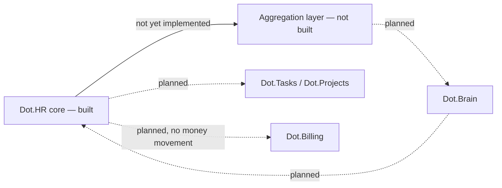

# Dot.HR

Purpose: this is Dot.HR's own knowledge home — owned and maintained by the Dot.HR team. It describes what this platform is, what it manages, and how it connects to the wider Dot Ecosystem. Dot.Brain never edits this file; it only reads what we choose to publish.

> **Related:** [Dot.Brain's ingested view of this platform](https://github.com/sakhilebhayi/Dot.Brain/blob/main/platforms/dot-hr.md)

---

## 1. What Dot.HR Is

Dot.HR is the Dot Ecosystem's workforce management platform: employment records, roles, and leave, built on Laravel 12 + Jetstream Teams like the rest of the ecosystem's team-scoped platforms. It owns the people domain — the ecosystem's most person-sensitive data, since nearly every field is PII and the data subjects are also the employees themselves, subject to a power asymmetry that no consent checkbox resolves.

**Status: MVP scaffolded, unverified.** This repository now contains real, hand-authored application code — Jetstream Teams shell, HR domain models, migrations, Policies, controllers, views, and tests — but it was written in an environment with no local PHP, Composer, or PostgreSQL, so **none of it has actually been run**. Treat the code as a careful, reviewed draft, not a tested build, until `composer install && php artisan migrate && php artisan test` has been run for real. See the change log below.

## 2. Design Principle: Work, Not Workers

The rule that shapes everything else here: **Dot.HR publishes knowledge about work — roles, skills, schedules, workforce structures — and never publishes knowledge that models, ranks, or predicts an identified or identifiable individual.** Employment records (names, contact details, role, employment status) are excluded from the shared knowledge graph at the type level — not filtered at review time, but structurally absent from what can ever be published. This is a stricter posture than "redact PII before sharing"; it means the category of individual-level record has no representation in the outbound data model at all, and today it isn't wired to any outbound path at all — there is no aggregation layer yet (see §9).

Data-protection posture (POPIA/GDPR alignment, field-level classification, encryption at rest) remains roadmap intent, not an implemented guarantee — see §9. The MVP domain layer deliberately keeps its PII surface minimal (name, work contact, role, employment status/dates) and avoids the `prohibited`-tier fields named in Dot.Brain's field-classification register entirely — no national ID/passport numbers, no salary, no medical or disciplinary data. If those fields are ever added, they need real encryption-at-rest and access-control review first, per Dot.Brain's `os/17-Security.md`.

## 3. Domain Entities (Built, MVP)

| Entity | Table | Notes |
|---|---|---|
| `Position` | `positions` | Job/role definition — describes work, not a worker. Team-scoped org structure. |
| `Employee` | `employees` | Employment record. Minimal PII: name, work email/phone, position, employment type, status, start/end date, optional link to a platform `User` login. No ID numbers, salary, or medical data. |
| `LeaveRequest` | `leave_requests` | Pending/approved/denied leave workflow, tied to one employee. Free-text `reason` treated as sensitive (can incidentally carry health information). |

Not yet built (see §9 roadmap): skills/certification tracking, roster/schedule templates, the aggregation layer, and any of the events/metrics described in §4/§7 below — those remain design intent inherited from the original blueprint, unchanged from v0.1.0.

## 4. Events We Plan to Emit (unchanged — not yet implemented)

| Event | Trigger | Frequency (intent) |
|---|---|---|
| `people.certification.expiring_cohort` | A cohort of certifications nears expiry (aggregate, above a minimum group size) | weekly |
| `people.roster.published` | A schedule cycle closes | per cycle |
| `people.vacancy.aging` | A role stays unfilled past a threshold | as triggered |

These remain intent, named for consistency with Dot.Brain's ingestion contract — none are implemented. No aggregation layer exists yet to safely emit them.

## 5. Architecture (Current)

- **Core service (built)**: Laravel 12 + Jetstream Teams + Fortify + Sanctum, team-scoped throughout. `Position`, `Employee`, `LeaveRequest` are the system of record for the MVP people domain.
- **Aggregation layer (not built)**: still the only intended path by which anything would leave the platform toward the shared knowledge graph. No code exists for this yet — the MVP has no outbound integration at all.
- **Boundary with Dot.Billing**: HR owns the roster; Billing owns money movement. Payroll execution is explicitly out of scope here, and no Billing integration exists in this codebase.
- **Boundary with Dot.Tasks/Dot.Projects**: HR owns role/skill definitions; task assignment (who does what today) belongs to Tasks. No integration exists yet.

## 6. Connecting to Dot.Brain

Dot.HR intends to participate in the ecosystem as a registered platform (`dot-hr`) that publishes Knowledge Packs about workforce structure — never about individual workers. **None of this is implemented in code yet** — this section remains design intent.

| Payload type | Cadence (intent) | Contains |
|---|---|---|
| `observation` | monthly | skills-coverage and roster-pattern aggregates |
| `insight` | per finding | workforce-structure findings |
| `outcome` | per verified recommendation | recommendation verification results |
| `incident` | per incident | PII-gate events, scheduling failures |

Consumption rule (intent): recommendations from Dot.Brain may target structures — rosters, role definitions, renewal calendars — never individuals.

Full manifest, entity/event mapping, the field-classification tiering, and a worked publish-to-PR round-trip are maintained on the Brain side at [`platforms/dot-hr.md`](https://github.com/sakhilebhayi/Dot.Brain/blob/main/platforms/dot-hr.md) — that document is Dot.Brain's ingested view and is authoritative for integration mechanics; this wiki is authoritative for what Dot.HR actually *is*.

## 7. Domain Metrics (Planned, not yet computed)

| ID | Type | Definition |
|---|---|---|
| `people.critical_role_coverage_rate` | ratio | Critical roles with qualified coverage at or above plan, over all critical roles |
| `people.cert_lapse_rate` | ratio | Certifications lapsed while the role is active, over certifications due, quarterly |
| `people.unfilled_shift_rate` | ratio | Shifts unfilled at cycle close, over shifts planned |

None of these are computed by the MVP — there is no certification or scheduling data model yet.

## 8. Engagement Mechanics — Deliberately Constrained

Dot.HR is, by nature, the highest-risk platform in the ecosystem for engagement mechanics aimed at workers by their employer. Posture (unchanged, still design intent — no engagement mechanics of any kind exist in this MVP): no individual productivity scores, no attendance streaks, no peer comparison of any kind, no "top performer" surfaces. If any milestone/recognition mechanic ships, it is scoped to team-level certification or coverage goals — never to an individual.

## 9. Roadmap

- [x] Stand up the core service MVP: employment records, roles, leave — with team-scoped authorization from the first commit
- [x] **Role-gate Employee/LeaveRequest/Position mutations beyond team membership.** `create`/`update`/`delete` on all three now require the team's `admin` role or ownership (`hasTeamRole($team, 'admin')` / `ownsTeam($team)`); `view`/`viewAny` stay open to any team member for day-to-day roster/leave-approval work. `LeaveRequest::create` is gated too (not just update/delete), since this app has no "an Employee's own User account" concept yet — any member could otherwise fabricate a leave record for an arbitrary employee. Covered by `tests/Feature/HrAuthorizationTest.php`'s role-gating block (editor-forbidden / admin-allowed pairs for all three models plus leave-approval).
- [ ] Skills/certifications and scheduling/roster models
- [ ] Build the aggregation layer as a structural boundary (not a filter) between individual and shared data
- [ ] Define and implement the field-classification register (prohibited / aggregate-only / aggregate-standard / open tiers) in code, not just doc
- [ ] POPIA/GDPR field-tier mapping and sign-off
- [ ] Implement the three named events and first Knowledge Pack publication
- [ ] Team-level certification/coverage recognition surface (only engagement mechanic in scope)
- [ ] Worker-visibility channel for aggregate categories published about the workforce
- [ ] Actually run this codebase against real PHP/Composer/PostgreSQL and fix whatever the first `php artisan migrate` and `php artisan test` reveal — see change log

## Change Log

| Version | Date | Author | Change |
|---|---|---|---|
| 0.5.0 | 2026-08-03 | Sakhile Bhayi (AI-assisted) | **Marketing welcome page rebuilt from scratch — it had never been customized.** `resources/views/welcome.blade.php` turned out to be the stock, unmodified Laravel/Jetstream scaffold (default two-column card layout with the Laravel wordmark SVG and a flat pink/red background block) rather than a real marketing page, unlike the sibling `Dot.Mines` repo's pre-built hero/features/CTA layout used as the intended reference pattern. Built a full custom page matching that structural pattern (nav, hero, features, capabilities, principles/CTA, footer) instead, with copy drawn only from this wiki's §1–§9 (Position/Employee/LeaveRequest entities, the "work, not workers" design principle, the Dot.Billing/Dot.Tasks boundary notes, and the honest MVP-scaffolded status) — no fabricated stats, testimonials, or customer logos. Nav and footer brand marks now use the real `public/images/logo.png` lockup in place of the Laravel wordmark SVG. Hero background: real diverse-team-office-collaboration photo by Vitaly Gariev (@silverkblack), unsplash.com/photos/fm4B1xWEIsU (`photo-1758873269276-9518d0cb4a0b`). Principles/CTA section background: real team-collaborating-around-a-computer photo by the same photographer, unsplash.com/photos/UikYLDQj9_I (`photo-1758873268745-dd2cf0d677b5`). Both hotlinked via Unsplash's CDN (images.unsplash.com); both URLs curl-verified (`HTTP/2 200`) before use; photographer credit kept as an inline HTML comment above each background declaration. Accent color kept as Jetstream's existing indigo (already used throughout the app's buttons/nav-links/forms) rather than importing Dot.Mines' amber theme. Dark gradient overlays added on both photo sections for text contrast. |
| 0.1.0 | 2026-08-01 | HR Platform Lead | Initial wiki: architecture blueprint derived from Dot.Brain's platforms/dot-hr.md, adapted to platform-owned framing with data-protection claims reframed as roadmap intent |
| 0.2.0 | 2026-08-01 | HR Platform Lead (hand-authored, AI-assisted) | **Hand-authored MVP scaffolding, unverified.** Jetstream Teams shell copied from Dot.Billing's reviewed boilerplate (Fortify/Jetstream actions, Team/User/Membership/TeamInvitation models, TeamPolicy, providers, ecosystem SSO controller, generic views). New HR domain layer: `Position`, `Employee`, `LeaveRequest` models and migrations, all team-scoped via `team_id`; `EmployeePolicy`, `PositionPolicy`, `LeaveRequestPolicy` enforcing `$user->belongsToTeam($model->team)` from the first commit (no authorization-added-later gap, unlike the Dot.Tasks/Dot.Finance findings this session's audit pass fixed retroactively); basic employee/leave-request CRUD + approve/deny workflow; a seeder with fictional demo data; `tests/Feature/HrAuthorizationTest.php` covering cross-team access denial. Built with **no local PHP/Composer/PostgreSQL available** — nothing in this commit has been executed, migrated, or tested. PII handling beyond team-scoped authorization (field-tier classification, encryption at rest, the aggregation layer) remains entirely roadmap intent, not implemented — see §9. |
| 0.3.0 | 2026-08-01 | HR Platform Lead | Closed the top-priority gap flagged in 0.2.0's own review: `create`/`update`/`delete` on Employee/LeaveRequest/Position now require the team's `admin` role or ownership, not just team membership. `view` stays open team-wide. Added a role-gating test block to `HrAuthorizationTest.php` (editor-forbidden / admin-allowed pairs). Still unexecuted — no PHP/Composer/PostgreSQL available. |
| 0.4.0 | 2026-08-02 | Sakhile Bhayi | **Executed for real, for the first time — and the 0.3.0 fix was broken.** `composer install` first failed outright: `bootstrap/cache/` didn't exist at all (`PackageManifest.php` requires it present and writable), unlike every other hand-authored platform — fixed by creating it. Once installed, all 16 `HrAuthorizationTest` tests covering the role-gating fix from 0.3.0 failed with HTTP 500, not 403: `EmployeeController`/`LeaveRequestController` call `$this->authorize(...)`, but the base `App\Http\Controllers\Controller` never included Laravel's `AuthorizesRequests` trait, so the method didn't exist — meaning **every authorization check in this platform's controllers was fatally broken**, not merely permissive, since the whole request 500'd before reaching any business logic. The 0.3.0 role-gating "fix" had never actually taken effect. Fixed by adding `use AuthorizesRequests;` to the base controller. Re-ran: all 19 `HrAuthorizationTest` cases pass, full suite 41/41 non-skipped tests pass. This is the starkest example so far of why "written but unexecuted" code in this ecosystem cannot be treated as verified — see Dot.Brain os/13-Engineering-State.md §4a. |

## Open Questions

- POPIA/GDPR field-tier mapping final sign-off — blocked on Dot.Brain's legal-identity resolution work, shared with Dot.Billing.
- Worker-visibility rule: delivery channel for publishing aggregate categories back to the workforce itself — via Dot.Notify digest, or an in-platform page? (Dot.Brain's ingested view records this as resolved by `dot-design.md` §7.1 on the Brain side; this platform has not yet implemented that component.)
- Minimum cohort size for aggregate publication — Dot.Brain's ingested view assumes n ≥ 50/100 by tier; needs independent validation once real workforce-size distributions are known, and once an aggregation layer exists at all.
- Whether `EmployeePolicy`/`LeaveRequestPolicy`'s team-membership check is strict enough long-term, or whether HR data warrants a narrower "HR admin role only" check even within a team — flagged in the Policy docblocks as an MVP-scope decision worth revisiting once real usage patterns are known.
